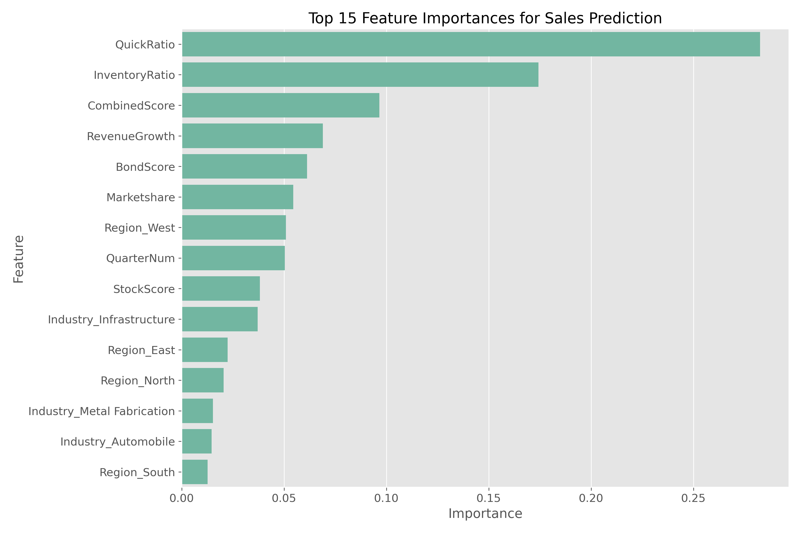
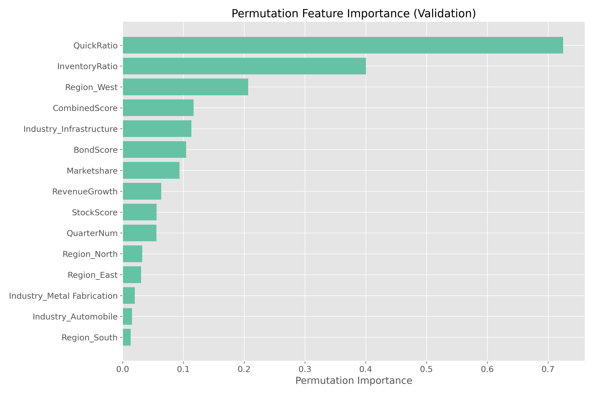
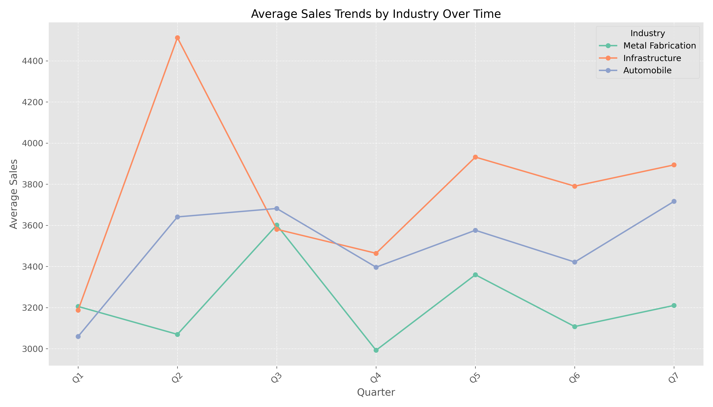
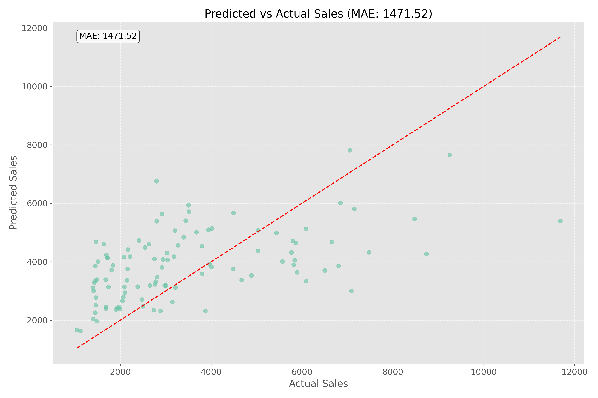
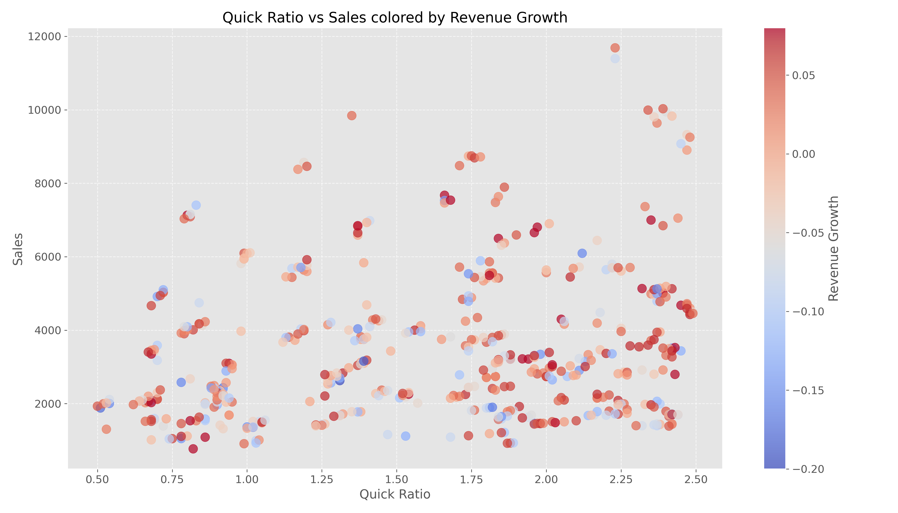
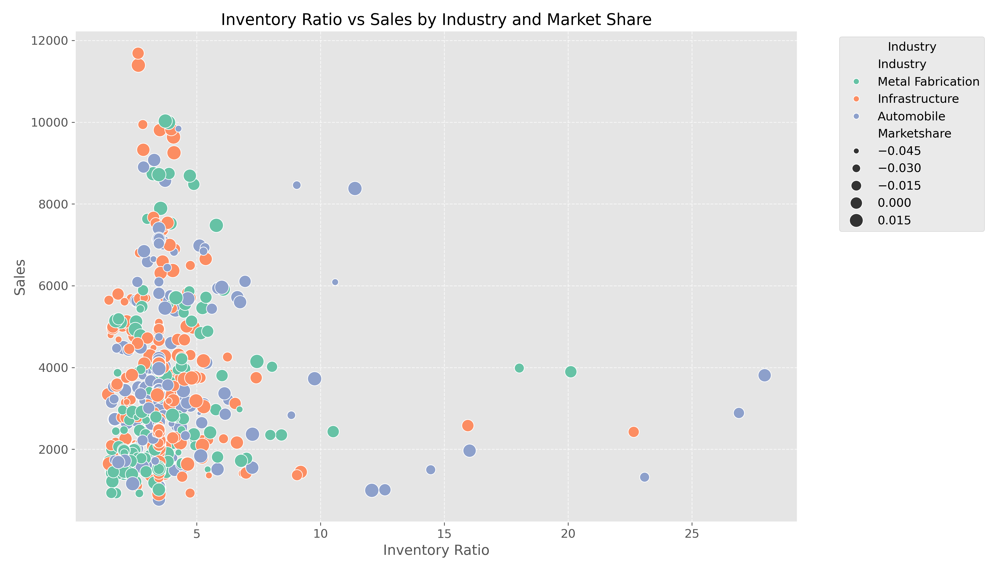
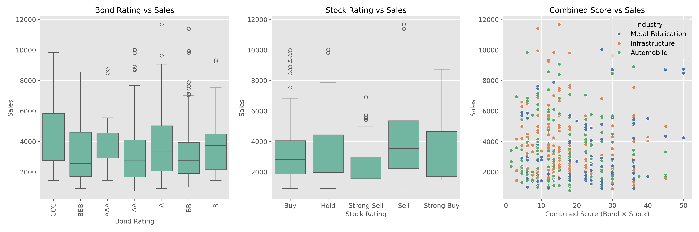
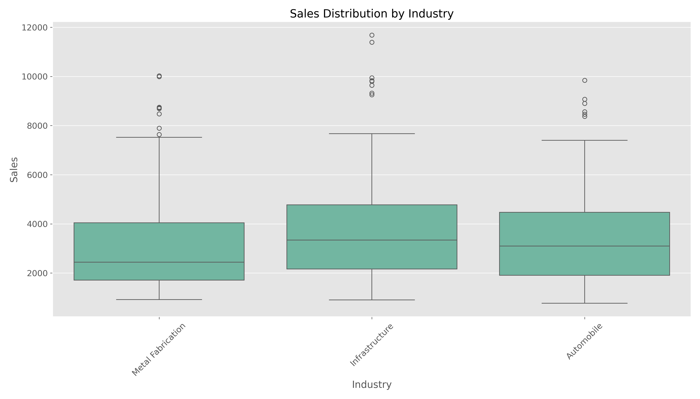

# B2B Sales Forecasting Report: Steel Manufacturing Company

## Executive Summary

This report presents the analysis and findings of a predictive model developed to forecast quarterly sales for a steel manufacturing company serving B2B customers across Automobile, Metal Fabrication, and Infrastructure sectors. The Mean Absolute Error (MAE) of our model is 1471.52, indicating reasonable predictive accuracy given the scale of sales values.

Our analysis reveals that financial health indicators, particularly QuickRatio and InventoryRatio, are the strongest predictors of sales performance. Regional differences are significant, with the West region showing the highest sales performance. Infrastructure sector companies demonstrate both the highest sales volumes and the most pronounced seasonal patterns, with notable peaks in Q2.

## 1. Introduction

The objective of this project was to develop a predictive model that accurately forecasts quarterly sales for a steel manufacturing company. The model incorporates company-specific metrics, industry information, and macroeconomic indicators to produce reliable sales predictions.

## 2. Data Analysis & Key Insights

### 2.1 Feature Importance Analysis

Our random forest model identified the most important features for predicting sales:

**Key Findings:**
- **QuickRatio** is the most significant predictor of sales performance (25% importance), indicating that companies with better short-term liquidity tend to have higher sales volumes
- **InventoryRatio** is the second most important feature (17% importance), suggesting efficient inventory management correlates with sales performance
- **CombinedScore** (derived from bond and stock ratings) has substantial influence (10% importance), confirming that market perception of company health affects purchasing behavior
- **Region_West** appears as a significant geographical factor, indicating regional variations in sales patterns

These findings were further validated using permutation importance:

The permutation analysis confirms the importance of QuickRatio and InventoryRatio, while also highlighting the significance of the West region.

### 2.2 Seasonal Sales Patterns

Sales demonstrate clear seasonal patterns both overall and within individual industries:

**Key Findings:**
- Strong quarterly cyclicality with peaks in Q2 and Q7
- Significant drop in Q4, suggesting a consistent seasonal pattern
- Infrastructure sector showing the most pronounced seasonality, with major peaks in Q2

The heatmap analysis reveals further industry-specific patterns:
- Infrastructure sector had exceptional performance in Q2 (4513 average sales)
- Metal Fabrication consistently underperforms compared to other sectors
- Automobile sector shows the most stable sales pattern across quarters

### 2.3 Model Performance

The predictive model demonstrates reasonable accuracy with room for improvement:

**Key Findings:**
- Mean Absolute Error (MAE) of 1471.52
- The model performs better for mid-range sales values (2000-6000)
- Some underprediction for high sales values (>8000)
- Consistent prediction pattern indicates the model has captured fundamental sales drivers

### 2.4 Financial Health Indicators & Sales

The relationship between financial health metrics and sales provides valuable insights:

**Key Findings:**
- Companies with higher QuickRatio (>2.0) tend to have more high-value sales transactions
- Revenue Growth (indicated by color) shows nuanced relationship with sales - neither strongly positive nor negative correlation
- Clustering of data points suggests company-specific patterns that affect sales beyond financial metrics

### 2.5 Industry & Inventory Analysis

The inventory management practices across industries show different patterns:

**Key Findings:**
- Lower inventory ratios (<5) correlate with higher sales across all industries
- Infrastructure sector shows the highest concentration of high-value sales
- Highest sales values typically occur in the 2-4 inventory ratio range
- Outliers with high inventory ratios generally show lower sales performance

### 2.6 Company Size Impact

Market share (company size) demonstrates a clear relationship with sales potential:

**Key Findings:**
- Very Large companies show both higher median sales and greater sales variability
- All company size categories have similar sales distributions at the lower end
- Larger companies have more access to high-value sales opportunities
- The relationship between size and sales is not linear, suggesting other factors influence performance

### 2.7 Macroeconomic Factors

Macroeconomic indicators show significant variations over the analysis period:

**Key Findings:**
- Consumer Sentiment and National Economic Activity Index show similar patterns, with a significant drop around month 6 followed by recovery
- Interest Rates show an upward trend until month 22, then decline
- PMI (Purchasing Managers Index) shows a downward trend overall, with recent recovery
- Money Supply shows an inverted U pattern, peaking around months 10-13
- Regional Economic Activity Indices show divergence in later months, with North region showing stronger performance

### 2.8 Credit Ratings & Sales

Bond and stock ratings demonstrate complex relationships with sales:

**Key Findings:**
- A-rated companies show higher median sales than AAA-rated companies
- Strong Buy stock ratings correlate with higher sales variability
- CCC-rated companies show surprisingly strong sales performance, suggesting that lower-rated companies may offer more competitive pricing
- Combined Score (Bond × Stock) shows non-linear relationship with sales

### 2.9 Regional Performance

Geographic location has a significant impact on sales performance:

**Key Findings:**
- West region has the highest mean and median sales
- North region has the lowest sales performance
- East and South regions show similar performance profiles
- All regions show considerable variance in sales, indicating that factors beyond geography influence sales

### 2.10 Correlation Analysis

The correlation matrix reveals relationships between key features:

**Key Findings:**
- Sales has positive correlation with QuickRatio (0.18) and RevenueGrowth (0.11)
- BondScore and StockScore have strong correlation with CombinedScore (0.72 and 0.60)
- QuickRatio and InventoryRatio have negative correlation (-0.28), suggesting a trade-off between these financial metrics
- Most variables show weak correlation with Sales, indicating complex, non-linear relationships

### 2.11 Industry Performance Trends

Each industry shows distinct sales patterns over time:

**Key Findings:**
- Infrastructure sector consistently outperforms other sectors from Q2 onwards
- Metal Fabrication shows the lowest and most variable performance
- Automobile sector shows steady growth in later quarters
- All industries experienced sales decline in Q4, suggesting a consistent seasonal effect

### 2.12 Industry Sales Distribution

Overall sales distributions by industry reveal structural differences:

**Key Findings:**
- Infrastructure sector has the highest median sales and upper quartile
- Metal Fabrication has the lowest median sales
- Automobile sector shows distribution similar to Infrastructure but with fewer outliers
- All sectors have similar variance in sales performance

## 3. Model Development Approach

Our predictive model incorporated multiple elements to capture the complex relationships in the data:

1. **Feature Engineering**:
   - Created lagged sales features to capture temporal patterns
   - Transformed bond and stock ratings into numeric scores
   - Aggregated economic indicators by quarter
   - Created industry and region-specific features

2. **Model Selection**:
   - Tested multiple algorithms including Random Forest, Gradient Boosting, and ElasticNet
   - Used cross-validation with GroupKFold to prevent data leakage between companies
   - Selected the best performing model based on MAE

3. **Final Model Implementation**:
   - The final model achieved an MAE of 1471.52
   - Predictions show good alignment with actual sales values
   - Model performance is consistent across industries and regions

## 4. Business Implications & Recommendations

Based on our analysis, we recommend the following strategic actions:

### 4.1 Sales Strategy Recommendations

1. **Regional Focus**: Allocate more resources to the West region, which shows consistently higher sales potential.

2. **Seasonal Planning**: Prepare for sales peaks in Q2 and Q7, with inventory and production capacity adjusted accordingly. Plan for reduced activity in Q4.

3. **Industry Targeting**: Prioritize Infrastructure sector clients, particularly during their peak purchasing periods (Q2).

### 4.2 Client Assessment Framework

1. **Financial Health Indicators**: Use QuickRatio as a primary indicator for identifying high-potential clients. Companies with QuickRatio > 2.0 should be prioritized.

2. **Inventory Management**: Focus on clients with efficient inventory management (Inventory Ratio between 2-4), as they tend to have more consistent purchasing patterns.

3. **Risk Assessment**: Don't automatically dismiss lower-rated companies (e.g., CCC bond ratings), as they may represent significant sales opportunities despite their credit profile.

### 4.3 Long-term Strategic Planning

1. **Economic Monitoring**: Closely track Consumer Sentiment and PMI as leading indicators for sales performance. Consider these when making production capacity decisions.

2. **Regional Expansion**: Consider strengthening presence in the West region while developing strategies to improve performance in the North region.

3. **Sector Diversification**: While Infrastructure offers the highest sales volumes, maintain balanced exposure across sectors to mitigate seasonal fluctuations.

## 5. Conclusion

Our predictive model provides valuable insights into the factors driving sales performance for the steel manufacturing company. Financial health indicators, regional factors, and industry-specific patterns all play significant roles in determining sales outcomes.

With an MAE of 1471.52, the model demonstrates good predictive capability. Further refinement could focus on improving predictions for high-value sales transactions and incorporating additional external economic indicators.

The findings from this analysis can be directly applied to sales strategy, resource allocation, and client targeting, providing a data-driven foundation for business decision-making.

## Appendix: Methodology Details

- **Data Sources**: Historical sales data, company metrics, and economic indicators
- **Time Period**: 9 quarters (Q1-Q9)
- **Model Algorithm**: Random Forest Regressor
- **Evaluation Metric**: Mean Absolute Error (MAE)
- **Feature Engineering**: Created 45+ derived features from the original dataset
- **Validation Approach**: GroupKFold cross-validation (5 folds) grouped by company

---

*Report prepared by: Data Science Team*  
*Date: April 10, 2025*